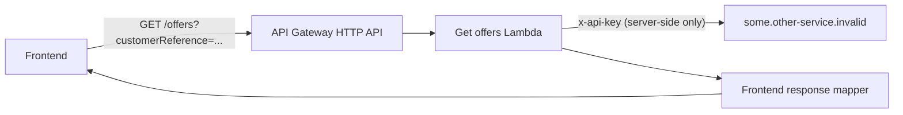

# Nx Serverless BFF

This repository is a compact, contract-first backend-for-frontend reference implementation. It
shows how a backend service can live inside a frontend-owned Nx monorepo while keeping its API,
runtime code, infrastructure, tests, and deployment lifecycle independently scoped.

There is deliberately no frontend implementation here. In the production setting that inspired
this sample, the surrounding monorepo is primarily frontend-oriented. This repository focuses on
the backend structure and the Nx project boundaries that make the BFF a good monorepo citizen.

The implementation is an independent clean-room sample. Its domain, API contract, infrastructure,
names, and test data are fictional and are not copied from an employer system.

## What it demonstrates

- An Nx workspace with one deployable BFF application and two focused libraries.
- Contract-first routing: the OpenAPI document is the source imported by API Gateway.
- An app-local Serverless Framework service root and CloudFormation resources.
- A small Lambda handler that validates a frontend request, calls a fictional upstream service,
  and maps the upstream representation to a stable frontend response.
- A runtime-loaded API key from AWS Secrets Manager, with a local environment fallback.
- Timeouts, explicit upstream error mapping, structured logs, request correlation, tracing, alarms,
  least-privilege IAM, and short non-production log retention.
- Generated TypeScript types and a CI check that detects OpenAPI/type drift.



## Repository layout

```text
apps/
  customer-offers-bff/       Deployable Lambda and Serverless/CloudFormation service
libs/
  api-contract/              OpenAPI source and generated TypeScript types
  other-service-client/      Typed, timeout-bound upstream adapter
docs/
  architecture.md            Architectural decisions and trade-offs
```

Nx is useful here even without frontend source: it models ownership boundaries, tracks the
application-to-library dependency graph, caches deterministic tasks, and makes affected-only CI
possible when the sample grows.

## API flow

`GET /offers` requires a `customerReference` query parameter. The Lambda calls:

```text
GET https://some.other-service.invalid/v1/offers?customerReference=<value>
x-api-key: <server-side secret>
```

The `.invalid` top-level domain is reserved for documentation and cannot accidentally address a
real production system. Unit tests inject a fake `fetch` implementation, so they perform no network
requests.

## API-key trade-off

The fictional upstream uses an API key to keep this example focused on BFF structure. The key is
never accepted from the frontend and is never returned or logged. In AWS, only its Secrets Manager
identifier is stored in the Lambda environment; the value is fetched at runtime and cached in the
warm Lambda container.

An API key identifies a calling application, but it is not a replacement for an OAuth 2.0 access
token. A real system that needs delegated authorization, scopes, short-lived credentials, token
audience validation, or end-user context should use an appropriate OAuth/OIDC flow instead.

## Requirements

- Node.js 24 LTS
- pnpm 11
- AWS credentials for packaging or deployment
- Serverless Framework authentication for Serverless Framework v4 commands

## Install and verify

```bash
corepack enable
pnpm install --frozen-lockfile
pnpm check
```

The quality gate verifies generated contract types, formatting, linting, TypeScript/esbuild builds,
unit tests, negative cases, and at least 80% line, statement, function, and branch coverage.

Useful individual commands:

```bash
pnpm graph
pnpm contract:generate
pnpm lint
pnpm test
pnpm build
pnpm package
```

## Configuration

| Variable                     | Purpose                               | Deployment default                           |
| ---------------------------- | ------------------------------------- | -------------------------------------------- |
| `UPSTREAM_BASE_URL`          | Fictional upstream base URL           | `https://some.other-service.invalid/`        |
| `UPSTREAM_API_KEY_SECRET_ID` | AWS Secrets Manager secret identifier | `nx-serverless-bff/<stage>/upstream-api-key` |
| `UPSTREAM_API_KEY`           | Local-only direct key fallback        | Not configured in AWS                        |
| `UPSTREAM_TIMEOUT_MS`        | Upstream request timeout              | `2500`                                       |

Never commit a real `.env` file or secret. `.env.example` contains only deliberately non-sensitive
sample values.

## Package and deploy

Create the configured secret in your AWS account before deployment. The exact command depends on
your account and secret-management process; do not put the value in this repository or in a deploy
command that may be retained in shell history.

Package the service:

```bash
pnpm package --stage dev
```

Deploy it:

```bash
pnpm exec serverless deploy \
  --config apps/customer-offers-bff/serverless.yml \
  --stage dev
```

Remove the stack when it is no longer needed:

```bash
pnpm exec serverless remove \
  --config apps/customer-offers-bff/serverless.yml \
  --stage dev
```

The stack uses on-demand Lambda/API Gateway capacity. CloudWatch logs still incur storage costs, so
non-production stages retain them for only one day.

## Dependency maintenance

Dependencies are pinned exactly and the lockfile is committed for reproducible builds. This sample
intentionally has no Dependabot or Renovate configuration. Updates are reviewed and applied
manually, followed by `pnpm check`.

## License

MIT
